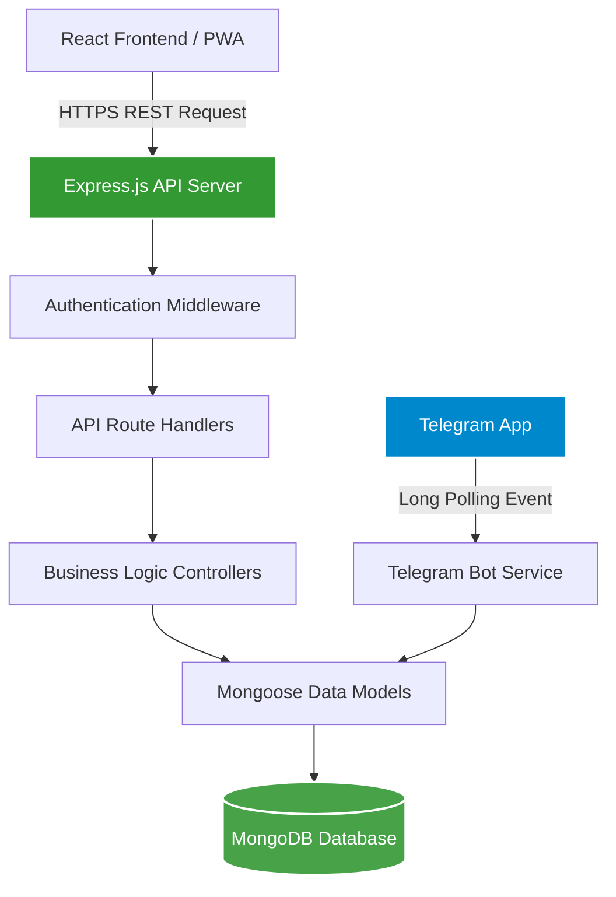
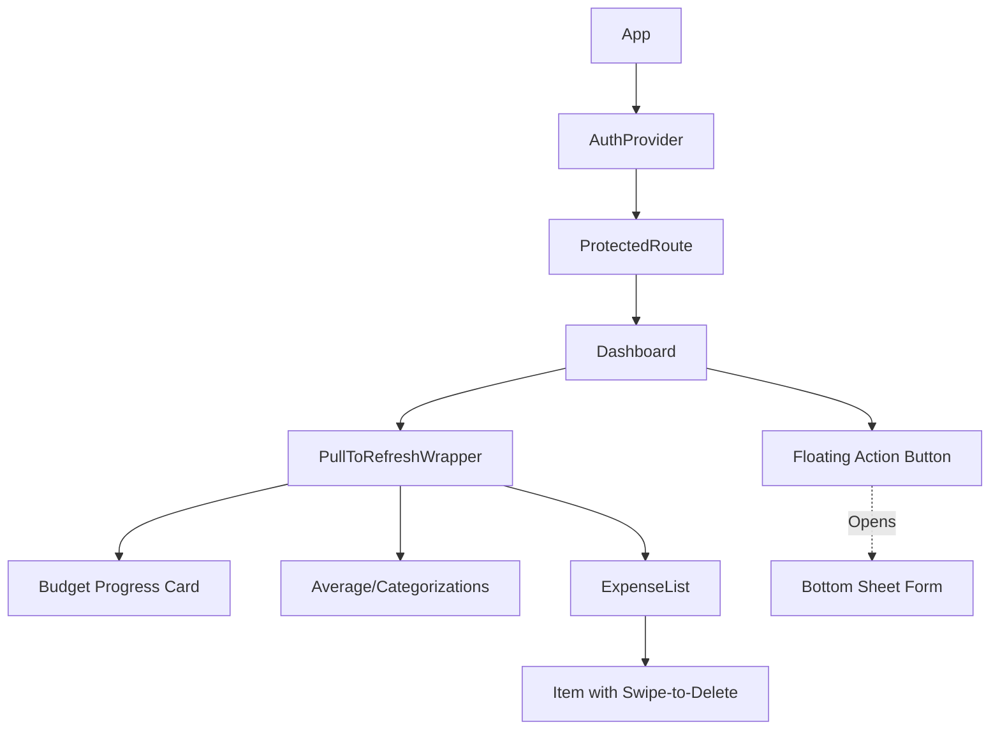
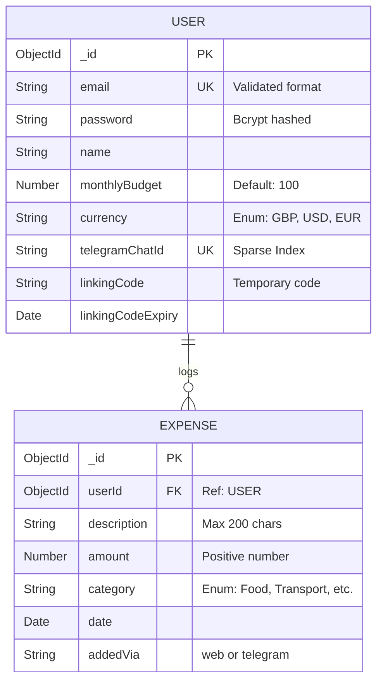
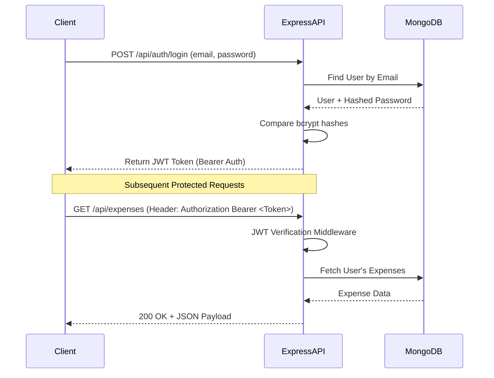
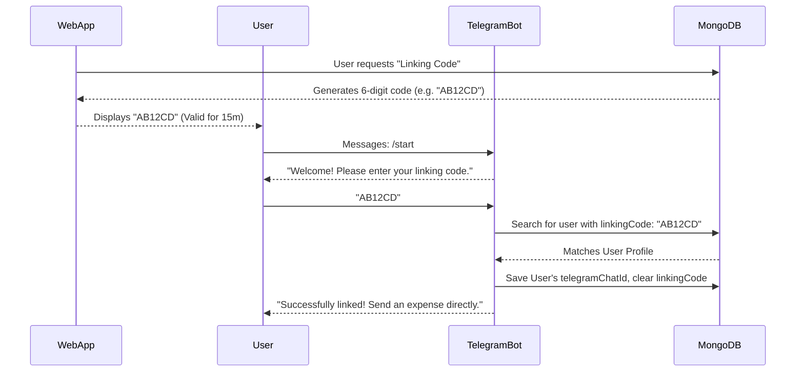

# Budgetly - Student Budget Tracker


Welcome to **Budgetly**, a modern, mobile-first full-stack application designed specifically to help students track and manage their expenses efficiently. 
It features a Progressive Web Application (PWA) alongside a unique **Telegram Bot** integration for logging expenses on the go. Best of all, it is **100% free and open-source**.

---

## 📖 Non-Technical Overview

### What is Budgetly?
Managing finances as a student can be overwhelming. **Budgetly** solves this by providing an intuitive platform that answers the fundamental question: *"How much money do I have left to spend this month?"*

### Core Features

#### 1. Real-Time Dashboard
- Instantly view your remaining budget, total spending, and recent expenses.
- Visual progress bars give you a clear understanding of your financial health at a glance.

#### 2. Telegram Bot Assistant
- **The Problem**: Opening an app to log a $3 coffee is friction. 
- **The Solution**: Link your Budgetly account to Telegram. Just text the bot (e.g., `"Spent 15 on Food"`) and it syncs instantly to your web dashboard!

#### 3. Deep Insights & Reports
- Understand your spending habits with interactive Pie and Line charts.
- See exactly which categories (Food, Transport, Bills) consume most of your money.

#### 4. Mobile-First & "App-Like" Feel
- Budgetly isn't just a website; it's a **Progressive Web App (PWA)**. 
- You can "Install" it to your phone's home screen.
- Features bottom navigation, swipe-to-delete gestures, haptic feedback (vibrations), and works beautifully on any mobile device.

---

## 🛠 Technical Overview

Budgetly is built on the **MERN Stack** (MongoDB, Express.js, React, Node.js). 
The project is split into two primary folders: 
- `/` (Root): The Frontend Web Application.
- `/backend`: The REST API and Telegram Polling Server.

### System Architecture

The following diagram outlines how the distinct pieces of the Budgetly ecosystem interact:



---

## 🖥 Frontend Deep Dive

The frontend is a single-page application (SPA) focused on extreme responsiveness and modern UI/UX design (Glassmorphism).

### Tech Stack
- **Framework**: React 18, utilizing Vite for fast bundling and HMR.
- **Styling**: Tailwind CSS with custom utility classes for safe-area insets and scroll hiding.
- **Routing**: `react-router-dom` managing protected and public routes.
- **State Management**: React Context API (`AuthContext`) manages global user sessions.
- **Data Fetching & Feedback**: `axios` for API calls, `react-hot-toast` for toast notifications.
- **Data Visualization**: `recharts` for scalable SVG charts.

### PWA Capabilities
The frontend implements modern PWA standards:
- **`manifest.json`**: Defines app name, theme colors (`#0a0a0a`), and standalone display modes.
- **`service-worker.js`**: Caches the application "shell" (HTML, CSS, core JS) allowing the app to load instantly even on flaky network connections.
- **Haptics & Gestures**: Utilizes the native `navigator.vibrate` API and touch event listeners for swipe-to-delete functionalities.

### Component Hierarchy (Dashboard Flow)


---

## 🖧 Backend & API Deep Dive

The backend handles data persistence, authentication, and the Telegram bot logic. It runs as a monolithic Node.js process.

### Tech Stack
- **Runtime**: Node.js (v16+)
- **Framework**: Express.js
- **Database**: MongoDB (Local or Atlas)
- **ODM**: Mongoose
- **Authentication**: JWT (`jsonwebtoken`) and bcrypt password hashing.

### Database Schema (Mongoose)



### Authentication Flow (JWT)

Security is handled via JSON Web Tokens (JWT). Passwords are never stored in plain text.



---

## 🤖 Telegram Bot Integration

A standout feature is the tightly coupled Telegram bot. It runs alongside the Express server, sharing the exact same Mongoose Models.

### Linking Flow
To securely link a Telegram account to a Web account, the user must prove ownership.



### Command Parsing
The bot parses natural-ish language: `"Spent 15 on Food"`
1. Matches regex `(?:spent|add)?\s*(\d+(?:\.\d{1,2})?)(?:\s+(?:for|on)\s+(.+))?`
2. Identifies `$15`, Description: "Food". Fallback Category applied.
3. Saves to MongoDB -> React Dashboard updates seamlessly.

---

## 🔒 Security Measures

Budgetly employs aggressive security measures at the backend level:
- **Rate Limiting (`express-rate-limit`)**: Defends against brute-force attacks on login endpoints and limits general API spam.
- **Data Sanitization**: Protects against NoSQL query injections via `express-mongo-sanitize` and Cross-Site Scripting (XSS) via `xss-clean`.
- **HTTP Header Security (`helmet`)**: Hardens Express properties, obscuring the "X-Powered-By" headers and setting tight Content Security Policies.
- **CORS Protection**: Access controls ensure Cross-Origin Resource Sharing is only permitted from authorized frontend URLs.
- **Encrypted Cryptography**: Passwords are mathematically salted and hashed utilizing `bcrypt`.

---

## 🚀 Setup & Installation Guide

To run Budgetly locally, you will need to run both the Frontend and Backend servers simultaneously. 

### Prerequisites
- [Node.js](https://nodejs.org/) (v16 or higher)
- [MongoDB](https://www.mongodb.com/try/download/community) (running locally or via Atlas)

### 1. Backend Setup
Navigate into the backend directory:
```bash
cd backend
npm install
```

Configure Environment Variables:
```bash
# Copy the example file
cp .env.example .env
```
Update `backend/.env` fields (crucial parameters):
```env
PORT=3000
DATABASE_URL=mongodb://localhost:27017/budgettracker
JWT_SECRET=your_super_secret_jwt_key
JWT_EXPIRE=30d
TELEGRAM_BOT_TOKEN=your_telegram_bot_token_here
FRONTEND_URL=http://localhost:5173
```

Start the Backend Server (with Nodemon for hot-reloading):
```bash
npm run dev
```

### 2. Frontend Setup
In a **new** terminal window, stay at the root directory:
```bash
# Ensure you are at the project root
npm install
```

Start the Frontend Server:
```bash
npm run dev
# The website will be available at http://localhost:5173
```

---

## 🤝 Contributing
1. Fork the Project
2. Create your Feature Branch (`git checkout -b feature/AmazingFeature`)
3. Commit your Changes (`git commit -m 'Add some AmazingFeature'`)
4. Push to the Branch (`git push origin feature/AmazingFeature`)
5. Open a Pull Request

## 📄 License
This project is 100% free and open-source. Distributed under the ISC License. See `LICENSE` for more information.
