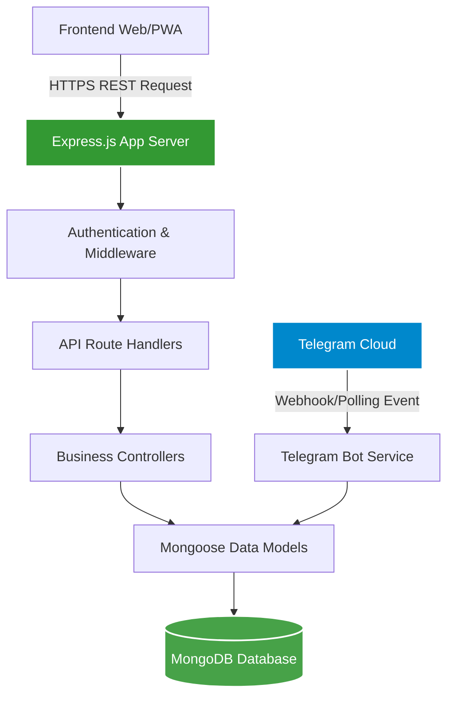
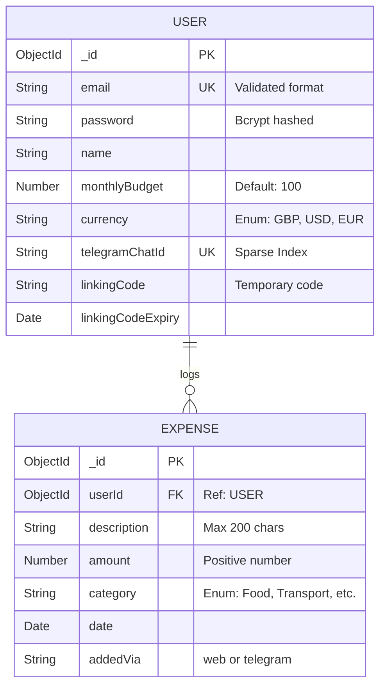
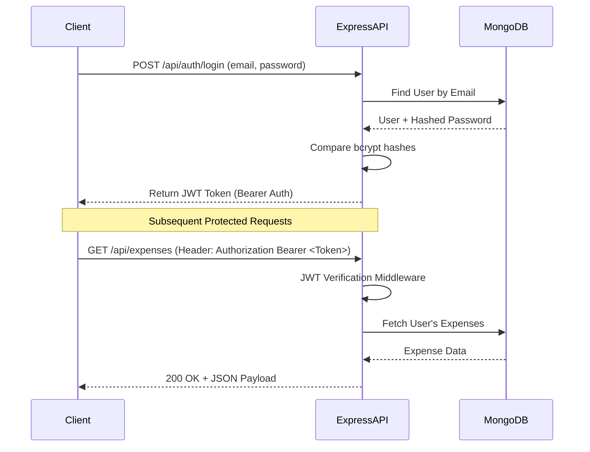
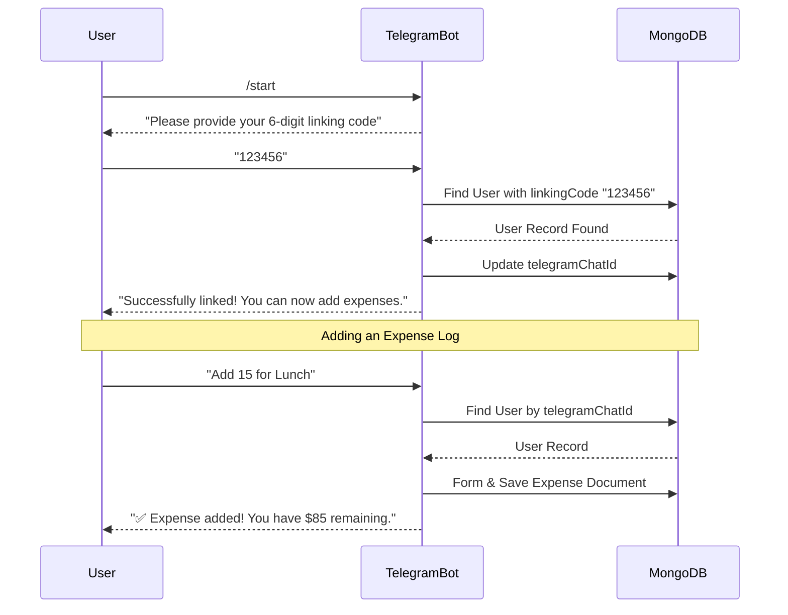

# Budgetly Backend & API

Welcome to the **Budgetly Backend** repository! This document serves as a comprehensive guide covering both technical and non-technical aspects of the system. This project is **100% free and open-source**.

---

## 📖 Non-Technical Overview

### What is Budgetly?
Budgetly is a modern, mobile-first student budget tracking application designed to help users manage their finances easily and effectively. The **backend** serves as the brain of the application. It securely stores user data, processes expenses, enforces budget limits, and serves the data needed to display visual dashboards on the website.

### Key Capabilities
- **Secure Accounts**: Users can create profiles with secure, encrypted passwords.
- **Expense Tracking**: Add, categorize (e.g., Food, Transport, Bills), delete, and view expenses.
- **Monthly Budgets**: Users can set a custom monthly budget limit and track their remaining balance.
- **Telegram Assistant**: A built-in Telegram integration that allows users to seamlessly add expenses by simply texting the bot from their phones.
- **Smart Insights**: Automatically calculates monthly totals, averages, and spending breakdowns to power the visual charts on your dashboard.
- **Mobile First Approach**: The API supports Progressive Web App (PWA) client features with fast, robust error handling.

---

## 🛠 Technical Overview

The Budgetly backend is built on **Node.js** and **Express.js**, utilizing **MongoDB** (with Mongoose) for robust data modeling and persistence. It serves a RESTful API and simultaneously runs a **Telegram Bot** polling service.

### System Architecture

The overarching request lifecycle follows a standard controller-service-model architecture, separating HTTP route definitions from core business logic.



### Database Schema

We use two primary collections: `Users` and `Expenses`.



### Authentication Flow (JWT)

Security is handled via JSON Web Tokens (JWT). Passwords are never stored in plain text.



### Telegram Bot Integration Flow

A unique feature of Budgetly is linking a Telegram account to a web account to log expenses via chat.



### Tech Stack Details
- **Runtime Environment**: Node.js (v16+)
- **API Framework**: Express.js
- **Database**: MongoDB (Local or Atlas)
- **ODM**: Mongoose
- **Authentication**: JWT (jsonwebtoken), bcrypt
- **Input Validation**: express-validator
- **Security Utilities**: helmet, xss-clean, express-mongo-sanitize, express-rate-limit
- **Bot Strategy**: node-telegram-bot-api

### Project Structure (Backend)
```text
backend/
├── src/
│   ├── config/       # Environment & DB configurations
│   ├── controllers/  # Route logic (auth, budget, expenses)
│   ├── middleware/   # Custom Express middlewares (auth, error-handling)
│   ├── models/       # Mongoose Schemas & Statics methods
│   ├── routes/       # API router configurations
│   ├── utils/        # Generic helpers (emailers, formatters)
│   └── server.js     # Express app & Bot entry point
├── tests/            # Automated test suites (Jest/Supertest)
├── scripts/          # Administrative/development scripts
├── docs/             # API documentation
├── .env.example      # Template for environment variables
└── package.json
```

---

## 🚀 Setup & Installation Guide

### 1. Prerequisites
- [Node.js](https://nodejs.org/) (v16 or higher)
- [MongoDB](https://www.mongodb.com/try/download/community) (running locally or via Atlas)

### 2. Install Dependencies
Navigate into the backend directory and install Node modules:
```bash
cd backend
npm install
```

### 3. Environment Variables configuration
Copy the template environment file to create your active `.env` file:
```bash
cp .env.example .env
```
Update `.env` fields as needed:
```env
PORT=3000
NODE_ENV=development
DATABASE_URL=mongodb://localhost:27017/budgettracker
JWT_SECRET=your_super_secret_jwt_key
JWT_EXPIRE=30d
TELEGRAM_BOT_TOKEN=your_telegram_bot_token_here
FRONTEND_URL=http://localhost:5173
```

### 4. Running the Server

**For active development (requires `nodemon`, auto-reloads on save):**
```bash
npm run dev
```

**For production deployment:**
```bash
npm start
```

### 5. Seeding the Database 
To test the API with pre-populated dummy data:
```bash
# If using seed scripts
npm run setup:production
```

---

## 🔒 Security Measures
Budgetly employs robust security measures at the backend level:
- **Rate Limiting**: Defends against brute-force attacks and limits API abuse.
- **Data Sanitization**: Protects against NoSQL query injections via `express-mongo-sanitize` and cross-site scripting via `xss-clean`.
- **HTTP Header Security**: Hardens Express properties using the `helmet` package.
- **CORS Protection**: Access controls ensure Cross-Origin Resource Sharing is only permitted from authorized frontend URLs.
- **Encrypted Cryptography**: Passwords are mathematically salted and hashed utilizing `bcrypt`.

## 🧪 Testing and Deployment
We rely on **Jest** and **Supertest** to execute test cases for logic validation:
```bash
npm run test
```

### Deployment Strategy
1. The server runs seamlessly in a Node engine environment (e.g. Railway, Heroku, or raw Linux VPS).
2. It's recommended to shift `NODE_ENV=production` context inside live environments.
3. MongoDB Atlas is recommended for cloud-based database availability over traditional self-hosted implementations.

---
**Maintained by the Budgetly Development Team.**
